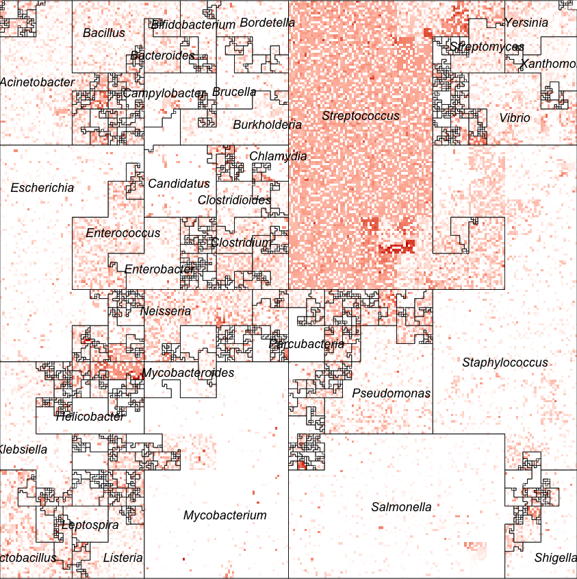
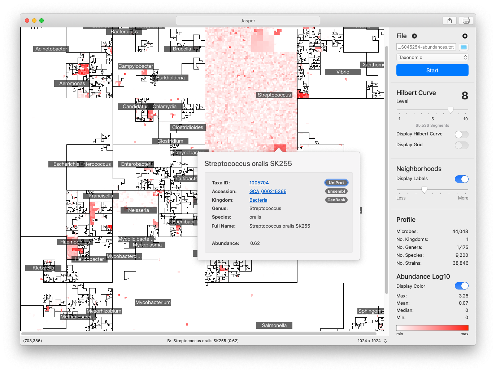

# Jasper: Microbiome Maps
Microbiome Maps are visualizations of microbial community  profiles. Each pixel in the image represents a single taxon from a reference genome collection profiled with [whole-genome DNA sequencing](https://en.wikipedia.org/wiki/DNA_sequencing) or [16S sequencing](https://en.wikipedia.org/wiki/16S_ribosomal_RNA). Community profiles contain the relative abundance measurements of thousands of genomes, and in a microbiome map they are ordered using the [Hilbert Curve](https://en.wikipedia.org/wiki/Hilbert_curve), making it possible to visualize the community profile of a single metagenomic sample with a single image.

Depending on the ordering of the genomes, different **microbial neighborhoods** can be created, allowing for different interpretations of "**Hotspots**", or clusters of abundant genomes in the images. Fixing the position of a genome results in visualizations that allow for quick comparisons of the abundance of the same genome or sets of genomes in multiple microbiome samples.

## Jasper for macOS
Microbiome Maps can be created with the [Jasper app](https://www.microbiomemaps.org/jasper). Jasper is a tool for creating rich, interactive microbiome maps that let you explore your metagenomic samples like never before. [Jasper](https://www.microbiomemaps.org/jasper) uses a [Hilbert Curve](https://en.wikipedia.org/wiki/Space-filling_curve) to place genomes on an interactive canvas that can display thousands of genomes at once. The Hilbert Curve placement allows for the clustering of related taxa into Neighborhoods that can quickly show you how abundant a taxonomic group is.

[Jasper](https://www.microbiomemaps.org/jasper) uses color as a proxy for abundance: areas with no color (white) represent genomes that are not present in the sample, while areas with a lot of color represent genomes that are very abundant. In [Jasper](https://www.microbiomemaps.org/jasper), if you see an area of interest, you can just hover your mouse over it or click on it. Clicking on an area brings up a detailed view that shows you the specifics of the taxa you clicked on, and you can then follow the links to find out a lot more.

[Jasper](https://www.microbiomemaps.org/jasper) is completely free, and available through the [Mac App Store](https://apps.apple.com/us/app/jasper-microbiome-maps/id1573180984). It requires macOS Catalina, 10.15, or greater.

You can learn more about it at [microbiomemaps.org](https://www.microbiomemaps.org)

## Jasper CLI (BETA)
A BETA non-interactive version of Jasper is available for command-line environments. **This version is undergoing active development and should not be used in production environments**. This version of Jasper is designed to process samples in batches and store non-interactive static images.

The CLI version of Jasper is designed for both **Python 3** and **R**.
